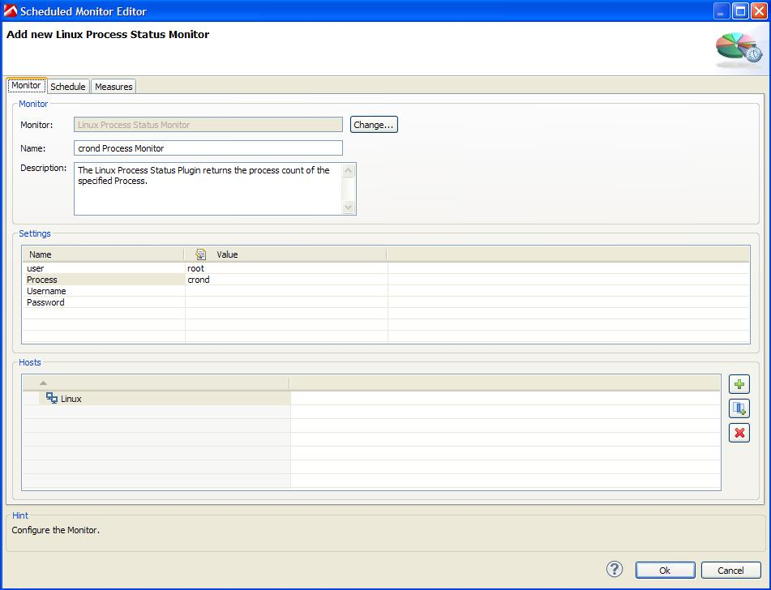
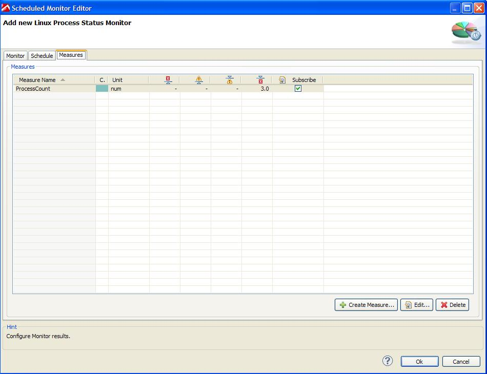
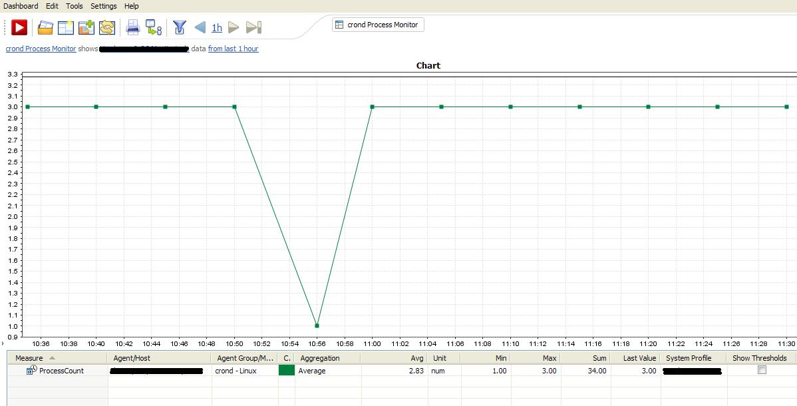

# Linux Process Monitor Plugin

## Overview

The monitor gets the process count via the ps -fu command. The user credentials entered when configuring the monitor must have ssh access to the remote server you wish to monitor.

Configuration screen for Linux Process Monitor

Measures provided by Linux Process Monitor

Exemplary dashboard based on ProcessCount measure

## Plugin Details

| Name | Linux Process Monitor Plugin
| :--- | :---
| Author | Derek Abing
| Supported dynaTrace Version | >= 5.5
| License | [dynaTrace BSD](dynaTraceBSD.txt)
| Support | [Not Supported ](https://community.compuwareapm.com/community/display/DL/Support+Levels#SupportLevels-Community)  
| Release History | 2012-03-05 Initial Release
| Download | [Linux Process Status Plugin 1.0.2](com.dynatrace.diagnostics.plugins.LinuxProcessStatusPlugin_1.0.2.jar)

## Provided Measures

  * **ProcessCount**: Returns count of running processes matching the configured identifier. 

## Configuration

| Name | Value
| :--- | :---
|user|The user the process is running under.
|Process|Linux Process name.
|Method|Specify the type of Connection.
|Authentication Method|Specify the type of SSH Authentication.
|Username|The username that is used for authorization with the host.
|Password|The password for the username.

## Installation

Import the Plugin into the dynaTrace Server. For details how to do this please refer to the [dynaTrace
documentation](https://community.dynatrace.com/community/display/DOCDT50/Manage+and+Develop+User+Plugins).

